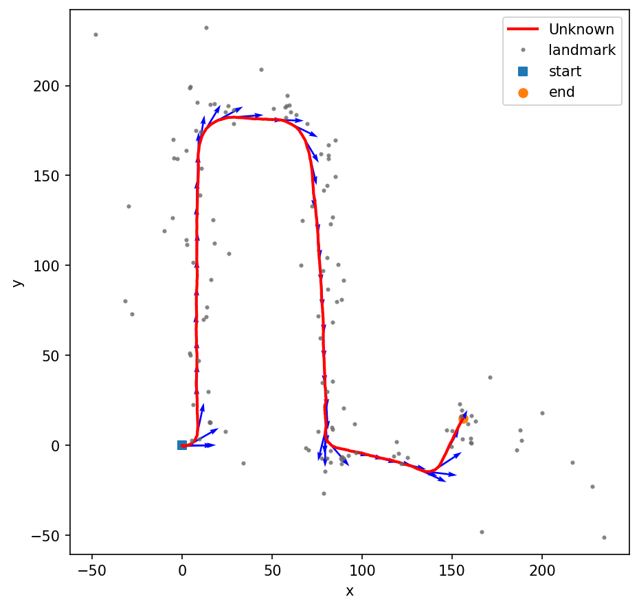
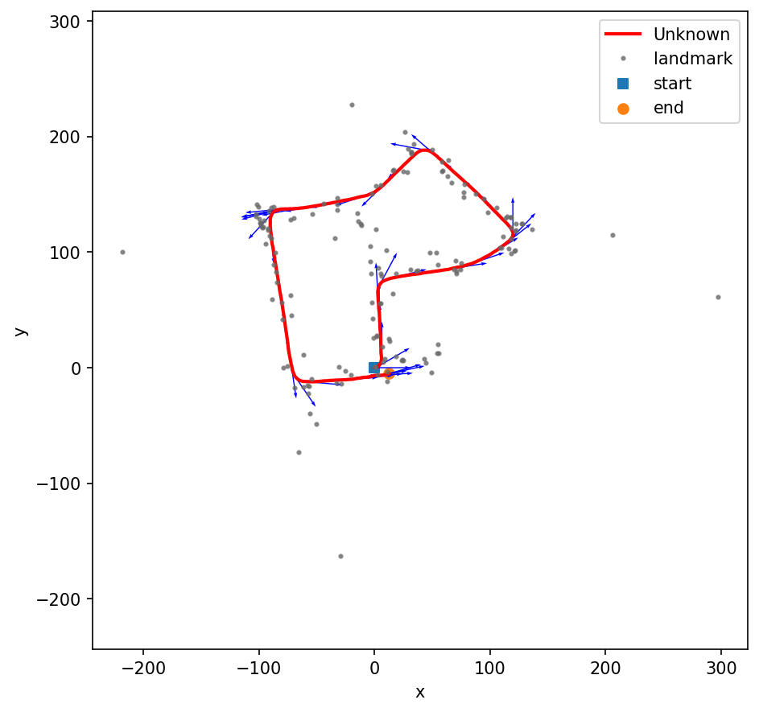

# Visual Inertial SLAM

Description
===========
This is project on Visual Inertial SLAM is done by Ayon Biswas[A53318795].

Code organization
=================
*ekf_slam.py -- Run the script for performing Visual Inertial SLAM by setting a dataset.
 
*utils.py -- contains helper functions for computing map Jacobian, IMU Jacobian, coordinate transformation from pixel to world frame, visualising trajectory.

*output -- contains outputs for all the datasets. DS_10 in output name means downsampling features by 10

Results
=======
scenario-1            |  scenario-2
:-------------------------:|:-------------------------:
 | 

Datasets
========
The dataset was provided with the starter code.

Parameters
==========
The noise parameters which worked with all the datasets are initialised in the script ekf_slam.py

Acknowledgements
================
I thank Prof. Nikolay Atanasov and TAs for their guidance and support.

